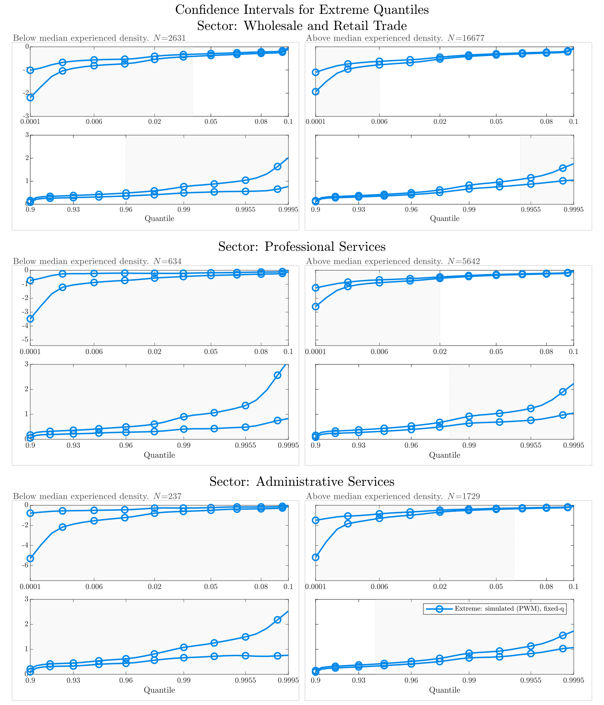

# Codes For: Inference on Extreme Quantiles of Unobserved Individual Heterogeneity

## Overview

This repository contains the codes for the paper **"Inference on Extreme Quantiles of Unobserved Individual Heterogeneity"** by Vladislav Morozov.
It contains

- A simulation study for the properties of various confidence intervals for extreme quantiles when only noisy observations are available. 
- An empirical application to differences in the productivity of the best and the worst firms in denser and less denser areas.

The codes are written in Matlab. They can run to reproduce the simulation and empirical results presented in the [paper](https://arxiv.org/abs/2210.08524) and the [Online Appendix](https://vladislav-morozov.github.io/files/2_noisyExtremeSupplement.pdf).

## Contents
   
- [About: Extreme Quantiles and Noisy Observations](#about-extreme-quantiles-and-noisy-observations)
- [Results: Tail Equivalence Conditions and Methods for Inference on Extreme Quantiles](#results-tail-equivalence-conditions-and-methods-for-inference-on-extreme-quantiles)
- [Software Requirements](#software-requirements)
- [How to Replicate the Simulations](#how-to-replicate-the-simulations)
- [Repository Structure](#repository-structure)
- [License](#license)
- [External Functions Used](#external-functions-used)
- [Contact](#contact)

 

## About: Extreme Quantiles and Noisy Observations

Extreme quantiles refer to the very low or very high values within a distribution.
 
It is sometimes important to estimate such extreme quantiles of objects that differ between individuals, firms, or studies (called individual unobserved heterogeneity). For example:

1. In industrial organization, firms may be different in terms of their productivity. One may then be interested in estimating the lowest level of firm-specific productivity that allows a firm to survive in the long term.  This productivity level is the 0th quantile of the productivity distribution of surviving firms.

2. In random effects meta-analysis, the true treatment effects of an intervention may differ between studies.  A 95% prediction interval is an interval such that the true treatment effect in a new study falls with probability 95% in it. Such intervals provide an important summary of between-study heterogeneity. To construct such an interval, one needs to estimate and quantify uncertainty about the 2.5th and 97.5th percentiles of the distribution of study-specific treatment effects.
 

The challenges lies in the fact that only noisy estimates of individual heterogeneity are available (firm productivity, study-level treatment effects). Such estimates are based on limited data like individual time series or small studies. Furthermore, the noise in the data and the true values of heterogeneity are often mixed together in a complicated way.

## Results: Tail Equivalence Conditions and Methods for Inference on Extreme Quantiles

In this paper, I present an approach to conduct inference on extreme quantiles when only noisy estimates are available. I lay out specific conditions under which the noisy data can still give us information about the extreme values we care about. Specifically, the tails of the distribution of noisy estimates need to converge to the tails of the distribution of interest in a certain weak pointwise sense.

I discuss methods to build confidence intervals for extreme quantiles. These confidence intervals use self-normalized ratios of order statistics of the estimates. Furthermore, I provide hypothesis tests regarding the support of individual heterogeneity. To back up these methods, I prove appropriate extreme and intermediate value theorems for noisy data.

## Empirical Results: Summary

 
## Software Requirements

- MATLAB (tested with 2024b).
- Required toolboxes: Parallel Computation Toolbox.
- Required File Exchange files: `tight_subplot`. Supplied with the replication code.

## How to Replicate the Results

1. Clone the repository to your local machine.
2. Open MATLAB and set the current folder to the repository directory.
3. Run the `main.m` up to reproduce all results:
  - Blocks I-IV contain the full simulations.
  - Black V export the plots for the empirical application.

## Repository Structure

- `src/`: Contains all source code, including custom classes, confidence intervals, distributions, and utility functions.
    - `src/classes/`: Custom classes for confidence intervals, data samplers, and results arrays.
    - `src/confidenceIntervals/`: Implementations of various confidence intervals.
    - `src/config/`: Configuration files for selecting methods, setting data generating processes, and parameters for simulations and plotting.
    - `src/distributions/`: Data generating process implementations.
    - `src/utilities/`: Various helper functions.
- `scripts/`: Contains executable scripts for running simulations and generating plots.
    - `scripts/simulation/`: Scripts to execute the actual simulations.
    - `scripts/plotting/`: Scripts to generate and export plots.
- `results/`: Directory to store simulation results:
  - `results/figures/`: Figures generated during the simulations.
  - `results/simulation/`: Full `.mat` files saved during the simulations.
  - `results/empirical/`: `.mat` files containing total factor productivity quantile estimation results (see `Note` below).
- `main.m`: The main script to run the simulations.
- `README.md`: This file.

> [!NOTE]
> The replication folder does not contain the contents of the `results/` folder. For simulations, this is done as the simulation results files are large. For the empirical application, there are restrictions on sharing the data, as the results are based on restricted-access microdata.
 
## License
This code is provided under the MIT License. You can use, copy, modify, merge, publish, distribute, sublicense, and/or sell copies of the software. You must include the original copyright notice and this permission notice in all copies or substantial portions of the software. The software is provided "as is", without any warranty of any kind, express or implied, including but not limited to the warranties of merchantability, fitness for a particular purpose, and non-infringement.

## External Functions Used

I grateful to the creators of the following functions on the Matlab File Exchange: 
1. `tight_subplot` by Pekka Kumpulainen (https://www.mathworks.com/matlabcentral/fileexchange/27991-tight_subplot-nh-nw-gap-marg_h-marg_w).

## Contact

For questions or feedback, feel free to contact me:
- [Vladislav Morozov](https://github.com/vladislav-morozov)
 